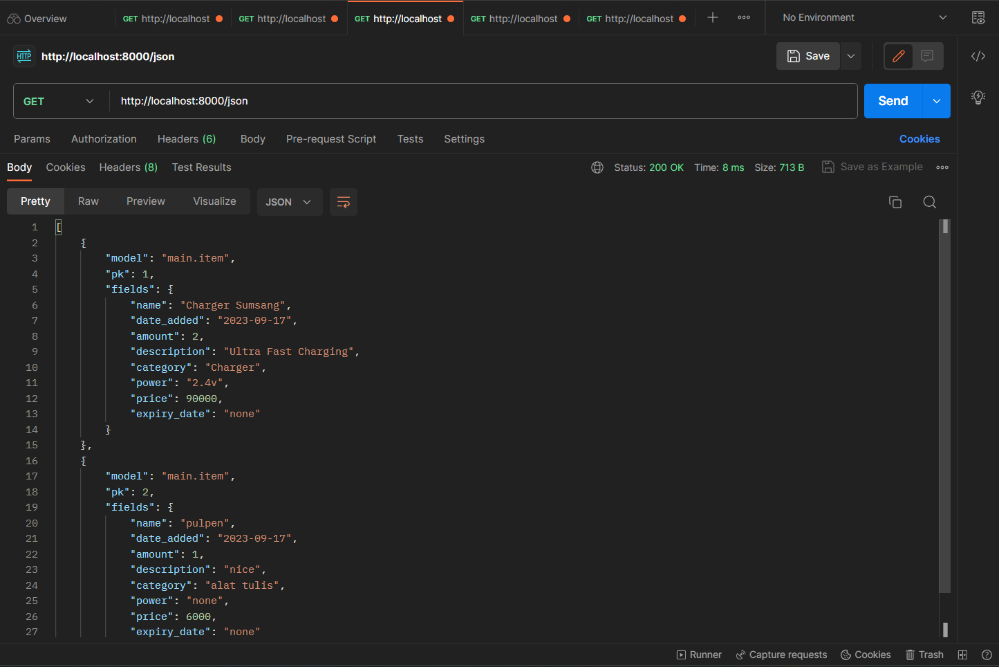
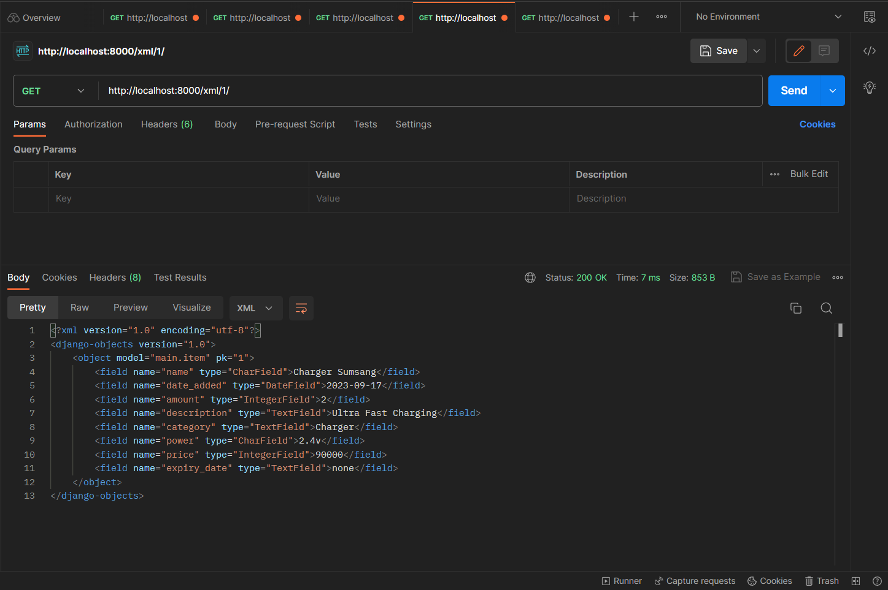

======================TUGAS 2===========================

1. Jelaskan bagaimana cara kamu mengimplementasikan checklist di atas secara step-by-step (bukan hanya sekadar mengikuti tutorial)!
-> Langkah awal yaitu dengan menentukan direktori folder untuk memulai proyek yang kemudian folder tersebut diinisiasikan dengan git (git init). Kemudian dilanjut dengan membuat repositori baru pada Github dengan visibilitas public. Setelah itu saya menghubungkan repositori lokal yang telah dibuat tadi dengan repositori di Github dengan menggunakan perintah "git branch -M main" dengan branch bernama "main" pada terminal.Kemudian saya membuat direktori ini sebagai virtual environment agar package dan dependencies pada aplikasi tidak bertabrakan dengan versi lain di komputer, hal tersebut dilakukan dengan perintah "python -m venv env" yang dilanjutkan dengan perintah "env\Scripts\activate.bat" untuk mengaktifkan virtual environment tersebut.

Kemudian saya mulai menambahkan berkas "requirements.txt" dan mengisinya dengan beberapa dependencies yang kemudian dipasang dengan perintah "pip install -r requirements.txt", kemudian saya memulai project django dengan perintah "django-admin startproject itemku .". Kemudian menambahkan "*" pada allowed host di settings.py untuk keperluan deployment. Setelah itu saya menambahkan berkas .gitignore pada direktori dengan berisi konfigurasi untuk menentukan apa saja yang perlu diabaikan oleh Git.

Langkah berikutnya yaitu membuat aplikasi main pada projek dengan menjalankan perintah "python manage.py startapp main", yang kemudian didaftarkan pada settings.py dengan menambahkan "main" pada variabel INSTALLED_APPS.

Langkah selanjutnya adalah membuat folder templates dalam aplikasi main, dan saya membuat berkas html bernama "daftar.html" untuk mengisinya dengan nama, deskripsi, dan detail lainnya untuk aplikasi. Kemudian pada models.py dalam aplikasi saya mengisinya dengan membuat class Product yang berisi data-data yang sesuai dengan aplikasi yang ingin dibuat. Setelah saya memodifikasi models.py diperlukan untuk melakukan migrasi model agar perubahan dapat dilacak oleh Django. Dilakukan dengan menjalankan perintah "python manage.py makemigrations" dan kemudian dilanjutkan dengan perintah "python manage.py migrate" untuk mengaplikasikan berkas migrasi ke basis data.

Berikutnya adalah menambahkan fungsi pada views.py, dengan mengisinya dengan dictionary yang berisi deskripsi dari model aplikasi yang kemudian akan dirender HTML yang ada dengan data yang diberikan. Setelah itu pada file daftar.html disesuaikan sintaksnya agar bisa mengambil data dari views.py.

Setelah itu saya mengonfigurasi Routing URL agar aplikasi 'main' dapat diakses pada web. Caranya adalah dengan membuat berkas urls.py di dalam aplikasi main dan mengonfigurasinya dengan mengimpor fungsi dari views.py kemudian membuat urlpatterns yang sesuai. Kemudain pada urls.py yang ada di dalam folder project, saya memodifikasi urlpatterns dengan menambahkan "path('main/', include('main.urls')),", juga mengimpor "include" dari django.urls. Maka server sudah dapat dijalankan dan aplikasi dapat ditampilkan dengan sesuai. Kemudian langkah terakhir ialah meng-deploy aplikasi tersebut ke dalam adaptable dengan konfigurasi yang sesuai.

2. Buatlah bagan yang berisi request client ke web aplikasi berbasis Django beserta responnya dan jelaskan pada bagan tersebut kaitan antara urls.py, views.py, models.py, dan berkas html!
-> 

3. Jelaskan mengapa kita menggunakan virtual environment? Apakah kita tetap dapat membuat aplikasi web berbasis Django tanpa menggunakan virtual environment?
-> Virtual environment bukanlah hal yang diharuskan untuk membuat aplikasi web berbasis django, kita bisa saja membuat suatu aplikasi web tanpa menggunakan virtual environment. Tetapi, virtual environment sangat membantu user dalam membuat aplikasi web pada Django dikarenakan fitur-fiturnya yang sangat baik, diantaranya adalah:
-Isolasi Lingkungan: Ini berarti Anda dapat memiliki versi yang berbeda dari paket Python dan dependensinya untuk setiap proyek tanpa ada konflik. Ini membantu menghindari masalah yang timbul ketika satu proyek memerlukan versi paket yang berbeda dari proyek lain.
-Manajemen Dependensi: Dengan virtual environment, user dapat menginstal paket-paket yang diperlukan hanya dalam lingkungan proyek tersebut, sehingga mempermudah dokumentasi dan distribusi proyek yang dibuat oleh user.
-Versi Python yang Berbeda: Dengan virtual environment, user dapat menggunakan versi python yang berbeda untuk setiap proyek, sehingga dapat membantu apabila user diharuskan menggunakan versi python spesifik yang lebih kompatibel dibandingkan versi lainnya.
-Kebersihan dan Keamanan: Virtual environment membantu menjaga kebersihan dan keamanan environment proyek. Sehingga user dapat menghapus atau memperbarui paket tanpa mempengaruhi proyek-proyek lain di lingkungan yang sama.
-Reproducibility: Dengan menggunakan virtual environment, user dapat mencatat daftar dependensi yang digunakan di dalam suatu proyek. Ini membuat proyek dapat lebih mudah untuk direproduksi di lingkungan lain dengan menginstal dependensi yang sama.

4. Jelaskan apakah itu MVC, MVT, MVVM dan perbedaan dari ketiganya.
-> MVC (Model-View-Controller), MVT (Model-View-Template), dan MVVM (Model-View-ViewModel) merupakan tiga pola arsitektur berbeda yang digunakan dalam pengembangan aplikasi web untuk memisahkan tugas dan tanggung jawab yang berbeda-beda. Ketiga arsitektur tersebut sama-sama memiliki dua komponen yang sama yaitu Model dan View, yang membedakan hanyalah komponen ketiga yaitu Controller pada MVC, Template pada MVT, dan ViewModel pada MVVM. Meskipun begitu, fungsi dan tanggung jawab dari View pada ketiga arsitektur tersebut juga sedikit berbeda satu sama lain. Model pada ketiga arsitektur tersebut memiliki kegunaan yang sama yaitu mengelola data dan logika bisnis. 

Pada MVC, View berguna untuk menampilkan informasi dan menanggapi input dari user, maka view sebagai tampilan dari aplikasi, kemudian Controller pada MVC berguna sebagai komponen yang menangani request dari user, memproses input, dan berinteraksi dengan Model serta menentukan tampilan yang harus ditampilkan. MVC merupakan arsitektur tertua dibandingkan MVC dan MVVM.

Untuk MVT, View bertanggung jawab untuk menampilkan data yang diberikan oleh Template dan merespons permintaan pengguna. Kemudian template merupakan bagian yang berisi tampilan HTML dengan kode template Django, yang kemudian digunakan untuk mengatur tampilan data dari Model dalam bentuk HTML. MVT adalah varian khusus dari Django, berbeda dengan arsitektur lainnya yang lebih umum.

MVVM merupakan arsitektur yang memiliki pola lebih umum yang biasanya digunakan oleh pengembang aplikasi berbasis antarmuka pengguna yang lebih kompleks, terutama di dunia JavaScript. ViewModel pada MVVM berfungsi sebagai komponen yang memisahkan logika tampilan dari View.ViewModel mengubah data dari Model menjadi format yang sesuai dengan tampilan dan mengatur komunikasi antara Model dan View. Ini sering digunakan dalam pengembangan aplikasi berbasis UI yang kaya seperti aplikasi web berbasis JavaScript. Kemudian View berfungsi untuk menampilkan data pada user.

======================TUGAS 3===========================

1. Apa perbedaan antara form POST dan form GET dalam Django?
Penggunaan metode POST dan GET dalam implementasi form memiliki kegunaan yang berbeda. Cara kerja metode POST adalah dengan mengumpulkan data dari form, melakukan encoding, mengirimkannya ke server, kemudian mendapatkan respon balik dari server. Sementara itu, metode GET mengumpulkan data ke dalam suatu string, dan menggunkannya untuk menyusun suatu URL. Metode POST sebaiknya digunakan apabila request yang diterima dapat membuat perubahan di sistem atau database, sementara metode GET hanya bisa digunakan apabila request tidak akan memberikan perubahan pada sistem. Maka, penggunaan metode POST lebih cocok untuk form password atau form lainnya yang mengandung data sensitif karena metode ini juga dilindungi oleh CSRF protection dari Django. Di sisi lain, metode GET lebih cocok digunakan misalnya untuk web search form, atau form yang berfungsi sebagai pencarian, karena URL yang disusun oleh metode GET lebih mudah untuk direpresentasikan dan juga mudah untuk dibagikan ke user lain.

2. Apa perbedaan utama antara XML, JSON, dan HTML dalam konteks pengiriman data?

XML (eXtensible Markup Language):
- Digunakan untuk data yang sangat terstruktur.
- Penggunaan tag terbuka dan tag penutup.
- Umumnya digunakan dalam konfigurasi aplikasi dan pertukaran data antar aplikasi.

JSON (JavaScript Object Notation):
- Digunakan untuk pertukaran data antar aplikasi, terutama di web.
- Menggunakan format pasangan key-value.
- Lebih mudah dibaca dan dihasilkan oleh manusia dan aplikasi.

HTML (HyperText Markup Language):
- Digunakan untuk membuat halaman web.
- Mendefinisikan struktur dan tampilan halaman web.
- Bukan dipergunakan untuk pertukaran data, melainkan sebagai tampilan di browser web.

3. Mengapa JSON sering digunakan dalam pertukaran data antara aplikasi web modern?
Banyaknya penggunaan JSON sebagai metode pertukaran data pada aplikasi web modern disebabkan oleh beberapa hal, beberapa diantaranya yaitu JSON memiliki syntax yang ringkas dan mudah dimengerti oleh penggunanya, JSON juga memiliki format yang ringan sehingga cocok untuk pertukaran data dalam lingkungan web yang cenderung fokus kepada kecepatan dan efisiensi, JSON juga dapat digunakan di berbagai bahasa pemrograman baik dari sisi pengirim maupun penerima sehingga menjadikannya lebih fleksibel dan lebih luas dalam penggunaannya, JSON juga memiliki library dan tools yang banyak sehingga dapat memudahkan pengembang dalam mengembangkan web yang lebih efisien dan rapi, JSON juga sangat populer dalam pengembangan API RESTful, yang merupakan pendekatan yang umum digunakan dalam pembangunan aplikasi web modern sehingga memungkinkan penggunaan yang lancar dan efisien dalam pengiriman data antara berbagai layanan web.

4. Jelaskan bagaimana cara kamu mengimplementasikan checklist di atas secara step-by-step (bukan hanya sekadar mengikuti tutorial).

Langkah pertama yang saya lakukan adalah membuat template base.html pada root folder sebagai kerangka views dari situs web kita,
kemudian mengubah settings.py pada direktori projek agar template base tadi bisa terdeteksi dengan mengubah setting "TEMPLATES".

Langkah kedua yaitu mengubah templates yg ada dalam folder aplikasi agar menyesuaikan dengan template utama base.html.

Langkah berikutnya adalah langkah untuk mengimplementasikan form pada aplikasi, yaitu dengan membuat file baru bernama "forms.py" pada folder aplikasi (main), kemudian mengisinya dengan membuat class baru bernama "ItemForm" dan juga mengimport model "Item" dari main.models. Kemudian pada views.py pada main ditambahkan fungsi baru bernama "create_item" yang berfungsi untuk menghasilkan formulir yang dapat menambahkan data item saat form disubmit oleh user. Kemudian fungsi show_main pada views juga disesuaikan agar bisa mengambil semua data Item yang ada. Kemudian menyesuaikan routing pada urls.py yang ada pada main.

Selanjutnya adalah membuat berkas html baru pada main/templates bernama "create_item.html" sebagai template untuk menampilkan form yang bisa disubmit. Kemudian memodifikasi kembali main.html agar bisa menampilkan produk yang baru disubmit dalam bentuk table.

Langkah selanjutnya untuk menampilkan kembali data dalam bentuk XML dan JSON adalah dengan mengimpor HttpResponse dan serializers pada views.py, kemudian membuat fungsi show_xml dan show_jason dengan isi sebagai berikut:

def show_xml(request):
    data = Item.objects.all()
    return HttpResponse(serializers.serialize("xml", data), content_type="application/xml")

sementara untuk JSON

def show_json(request):
    data = Item.objects.all()
    return HttpResponse(serializers.serialize("json", data), content_type="application/json")

Kemudian mengimpor kedua fungsi tersebut pada urls.py dan menambahkan path baru pada "urlpatterns" agar bisa diakses.

Langkah berikutnya yaitu membuat fungsi yang dapat mengembalikan data XML by ID dan JSON by ID, pertama-tama saya membuat dulu fungsinya di views.py dengan potongan kode sebagai berikut:

def show_xml_by_id(request, id):
    data = Product.objects.filter(pk=id)
    return HttpResponse(serializers.serialize("xml", data), content_type="application/xml")

untuk JSON by ID:

def show_json_by_id(request, id):
    data = Product.objects.filter(pk=id)
    return HttpResponse(serializers.serialize("json", data), content_type="application/json")

Kemudian mengimpor kedua fungsi tersebut pada urls.py yang ada di main dan menambahkannya pada "urlpatterns". Dengan begitu saya sudah memiliki kelima fungsi views yang dapat menampilkan data dalam bentuk HTML, XML, JSON, XML by ID, dan JSON by ID.

SCREENSHOT POSTMAN:

HTML:

XML:

JSON:

XML by ID (id = 1):

JSON by ID (id = 2):

======================TUGAS 4===========================

1. *Apa itu Django UserCreationForm, dan jelaskan apa kelebihan dan kekurangannya?*

`UserCreationForm` adalah salah satu dari banyak formulir bawaan yang disediakan oleh Django, sebuah framework web yang ditulis dalam Python. Formulir ini digunakan untuk membuat formulir pendaftaran pengguna (user registration form) dalam aplikasi web yang menggunakan Django. `UserCreationForm` memudahkan pengembang dalam membuat halaman pendaftaran pengguna dengan cepat, karena sudah mengatur banyak hal terkait pembuatan akun pengguna.

**Kelebihan:**

1. Mudah Digunakan: `UserCreationForm` merupakan bagian dari Django's built-in authentication system, sehingga mudah digunakan dan tidak memerlukan penulisan kode tambahan untuk mengelola pendaftaran pengguna.
2. Validasi Bawaan: Form ini sudah dilengkapi dengan validasi bawaan untuk memastikan bahwa pengguna memasukkan data yang benar dan sesuai, seperti memeriksa bahwa alamat email adalah unik dan bahwa kata sandi memenuhi persyaratan keamanan.
3. Kompatibilitas dengan Model Pengguna Bawaan: Form ini berintegrasi dengan model pengguna bawaan Django (`User`), yang memungkinkan Anda untuk menyimpan data pengguna dengan mudah dalam database.
4. Customizable: Meskipun `UserCreationForm` sudah mencakup sebagian besar fungsi yang diperlukan untuk pendaftaran pengguna, Anda masih dapat menyesuaikannya sesuai dengan kebutuhan proyek Anda dengan menambahkan atau mengubah bidang-bidang yang ada.

**Kekurangan:**

1. Tampilan Standar: `UserCreationForm` hanya menyediakan formulir backend, sehingga Anda masih perlu membuat tampilan depan (frontend) untuk halaman pendaftaran pengguna. Hal ini bisa menjadi pekerjaan tambahan tergantung pada kebutuhan desain Anda.
2. Kustomisasi Tambahan: Jika proyek Anda memiliki persyaratan pendaftaran pengguna yang sangat khusus, Anda mungkin perlu menulis formulir pendaftaran pengguna kustom dari awal daripada menggunakan `UserCreationForm`, yang dapat menjadi lebih rumit.
3. Ketergantungan Terhadap Model Bawaan: Jika proyek Anda memerlukan model pengguna yang sangat berbeda dari model `User` bawaan Django, Anda mungkin perlu menulis formulir pendaftaran pengguna kustom dan mengelola logika pendaftaran pengguna sendiri.

2. *Apa perbedaan antara autentikasi dan otorisasi dalam konteks Django, dan mengapa keduanya penting?*

*Autentikasi* adalah proses verifikasi identitas pengguna, sedangkan *otorisasi* adalah proses menentukan hak akses pengguna setelah autentikasi. Autentikasi memeriksa siapa pengguna tersebut, sementara otorisasi mengatur apa yang dapat mereka lakukan dalam aplikasi. Keduanya penting untuk menjaga keamanan dan kontrol akses dalam aplikasi web.

3. *Apa itu cookies dalam konteks aplikasi web, dan bagaimana Django menggunakan cookies untuk mengelola data sesi pengguna?*

Cookies dalam konteks aplikasi web adalah file kecil yang disimpan pada perangkat pengguna saat mereka berinteraksi dengan situs web. Django menggunakan cookies untuk mengelola data sesi pengguna dengan cara menyimpan informasi khusus pada cookie, seperti ID sesi, yang digunakan untuk mengidentifikasi pengguna saat mereka berpindah halaman atau berinteraksi dengan aplikasi web. Ini memungkinkan Django untuk melacak dan mempertahankan keadaan sesi pengguna di seluruh permintaan HTTP, yang penting untuk aplikasi yang memerlukan otentikasi dan keadaan sesi pengguna yang aman.

4. *Apakah penggunaan cookies aman secara default dalam pengembangan web, atau apakah ada risiko potensial yang harus diwaspadai?*

Penggunaan cookies dalam pengembangan web memiliki risiko potensial yang harus diwaspadai. Cookies dapat digunakan dengan aman jika diimplementasikan dengan benar, tetapi ada risiko seperti peretasan atau pencurian data sesi jika tidak ada tindakan keamanan yang memadai, seperti enkripsi data atau perlindungan terhadap serangan CSRF (Cross-Site Request Forgery). Oleh karena itu, pengembang web harus berhati-hati dan mematuhi praktik keamanan terbaik saat menggunakan cookies.

5. *Jelaskan bagaimana cara kamu mengimplementasikan checklist di atas secara step-by-step (bukan hanya sekadar mengikuti tutorial).*

-Pertama yaitu membuat fungsi register pada views.py dan membuat file html baru yang berisi tampilan register bernama register.html kemudian mengatur rute pada urls.py.
-Kedua sama seperti langkah pertama, tetapi kali ini membuat fungsi login untuk user yang sudah pernah register sebelumnya.
-Ketiga merupakan langkah yang sama, tetapi ini untuk fungsi logout, dan tidak perlu membuat file html baru untuk logout, instead kita menambahkan tombol logout pada tampilan utama "daftar.html"
-Langkah berikutnya yaitu dengan merestriksi pengguna yang dapat masuk dengan menambahkan login_required pada views.py
-Kemudian menambahkan cookies dengan cara memodifikasi kode pada login_user dan meng set cookienya kemudian menambahkan last_login pada context yg ada di fungsi show_main, kemudian menambahkan text tersebut pada tampilan html.
-Langkah selanjutnya adalah menghubungkan product dengan user dengan memodifikasi models.py pada main dan merubah potongan kode pada views.py spesifically pada fungsi create_item, kemudian mengubah fungsi show_main agar memfilter item sesuai user yg sedang login.

======================TUGAS 5===========================

1. *Jelaskan manfaat dari setiap element selector dan kapan waktu yang tepat untuk menggunakannya.*

`Tag Selector (tagname):` Memilih semua elemen dengan tag tertentu. Cocok digunakan saat ingin menerapkan gaya ke semua elemen dengan tag yang sama, seperti mengatur font atau warna latar belakang untuk semua teks p dalam dokumen.

`Class Selector (.classname):` Memilih semua elemen yang memiliki kelas tertentu. Berguna ketika ingin menerapkan gaya ke beberapa elemen dengan kelas yang sama, seperti mengatur warna latar belakang untuk semua elemen dengan kelas "button."

`ID Selector (#idname):` Memilih elemen dengan ID tertentu. Digunakan untuk elemen unik dalam dokumen, seperti header utama. Hanya satu elemen per dokumen boleh memiliki ID yang sama.

2. *Jelaskan HTML5 Tag yang kamu ketahui.*

<header>: Digunakan untuk mendefinisikan header atau bagian atas dokumen.
<nav>: Menunjukkan bagian navigasi dalam dokumen.
 : Digunakan untuk break

3. *Jelaskan perbedaan antara margin dan padding.*

`Margin:` Margin adalah jarak antara elemen dan elemen lain di sekitarnya. Margin mengatur ruang di luar elemen. Margin elemen tidak memiliki latar belakang atau warna. Margin digunakan untuk mengatur jarak antara elemen dengan elemen lain di sekitarnya.

`Padding:` Padding adalah jarak antara batas elemen dan kontennya. Padding mengatur ruang di dalam elemen. Anda dapat memberikan elemen padding untuk menjaga jarak antara konten elemen dan batasnya.

4. *Jelaskan perbedaan antara framework CSS Tailwind dan Bootstrap. Kapan sebaiknya kita menggunakan Bootstrap daripada Tailwind, dan sebaliknya?*

Tailwind CSS: Tailwind adalah framework CSS yang fokus pada konfigurasi menggunakan kelas-kelas CSS yang telah ditentukan sebelumnya. Ini memberikan fleksibilitas besar dalam menyesuaikan tampilan elemen. Cocok untuk proyek-proyek yang membutuhkan desain yang sangat disesuaikan atau proyek yang ingin menghindari gaya bawaan.

Bootstrap: Bootstrap adalah framework CSS yang menyediakan banyak komponen dan gaya bawaan untuk membangun situs web dengan cepat. Ini cocok untuk proyek-proyek yang ingin menghemat waktu dalam pengembangan dan ingin tampilan yang konsisten.

5. *Jelaskan bagaimana cara kamu mengimplementasikan checklist di atas secara step-by-step (bukan hanya sekadar mengikuti tutorial).*
Pertama adalah dengan menambah tombol **edit** dan **delete** dengan menambah fungsinya pada views.py dan me link urlnya dan menambah tombolnya di html. Kemudian saya mendesain halaman login dan main agar elemennya berada di tengah halaman dengan meng centernya di CSS.